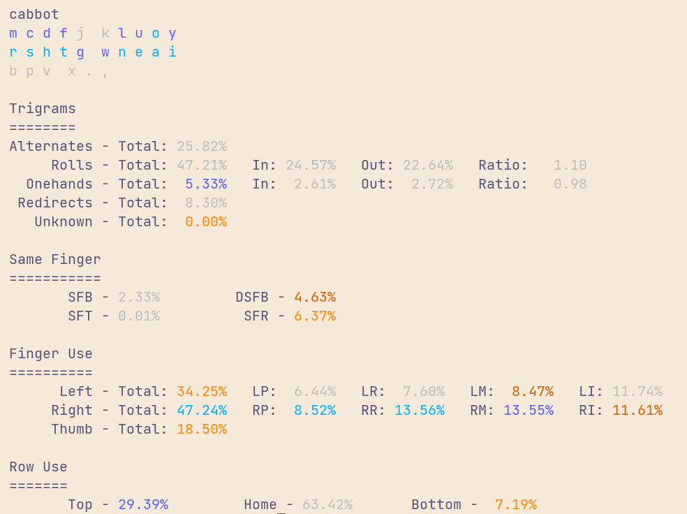
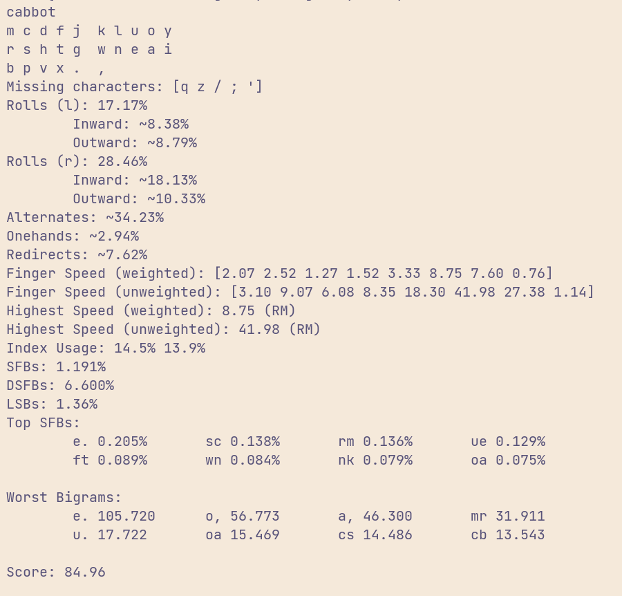

# cabbot Layout

Designed for the [alpha](https://github.com/PyrooL/Alpha) (a 26-key semi-ortho
board) with inspiration from [semimak](https://github.com/semilin/semimak),
[canary](https://github.com/Apsu/Canary), and a few other layouts I've tried.
It prioritizes top row and home row usage while discouraging usage of the bottom
row as it's less ergonomic due to the nature of a semi-ortho keyboard.

```
f c d m j k l u o y
r s h t g w n e a i
  b p v      x . ,
```

You may note that `Z` and `Q` are missing, these can be swapped `.` and `,`
respectively if you like, but I rather have these on combos as they're the least
frequently used keys.

# [a200](https://github.com/ClemenPine/a200)




# [genkey](https://github.com/semilin/genkey)



